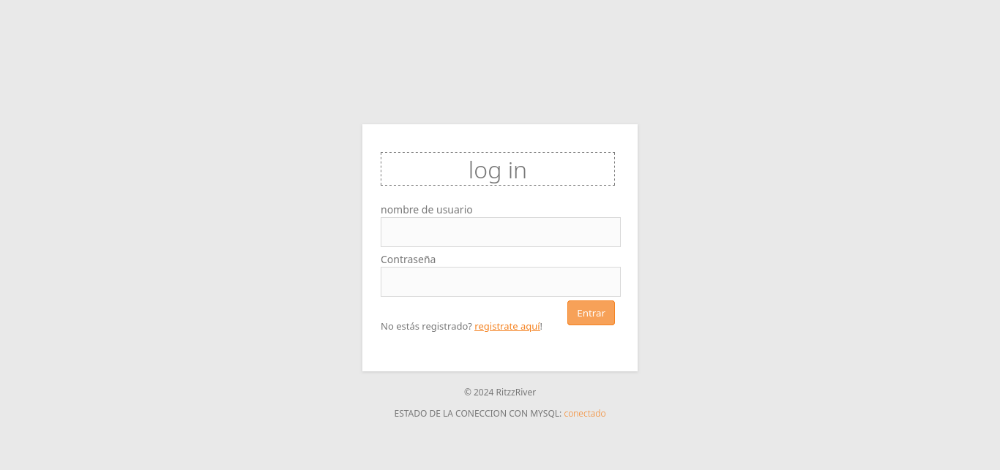

# Login con PHP

Este es un login de PHP basico con funciones de comprobación de datos

## Uso

### Iniciar la base de datos

en MYSQL importar el archivo `src/database/database.init.sql` y crear un usuario con la siguiente info
    
``` bash
username => API
password => cKB8Jl*fqV7tIXEP
permissions => base
```

> [!WARNING]
> Si la base de datos no está bien configurada puede dar problemas al momento de iniciar/ejecutar el proyecto

### Iniciar el proyecto

> [!NOTE]
> Como el proyecto está hecho en el servidor embebido de PHP puede que hayan algunas incoherencias y errores en el funcionamiento.

#### estando el proyecto en `XAMPP/htdocs`

ingresar a https://localhost/login/

#### usando el servidor embebido de PHP (RECOMENDADO)

ejecuta el siguiente comando para activar el servidor de php es:

```bash
php -S localhost:8000
```

una vez se está ejecutando ve a http://localhost:8000

> [!IMPORTANT]
> Asegurate de que la pagina principal del login aparezca el estado como conectado
> Se ha de ver tal que así:
> 

# Creditos

https://blog.hostdime.com.co/guia-para-crear-un-sistema-de-inicio-de-sesion-y-registro-usando-php-y-mysql/
